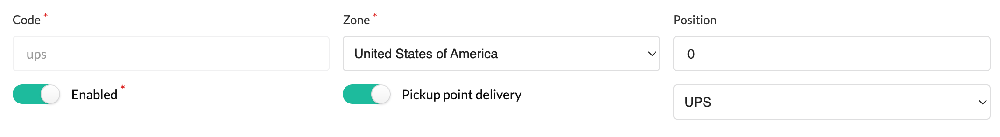

# Sylius plugin for Shipmondo

[![Latest Version][ico-version]][link-packagist]
[![Software License][ico-license]](LICENSE)
[![Build Status][ico-github-actions]][link-github-actions]
[![Code Coverage][ico-code-coverage]][link-code-coverage]

## Installation

```bash
composer require setono/sylius-shipmondo-plugin symfony/webhook
```

### Add plugin class to your `bundles.php`

Make sure you add it before `SyliusGridBundle`, otherwise you'll get
`You have requested a non-existent parameter "setono_sylius_shipmondo.model.remote_event.class".` exception.

```php
<?php
$bundles = [
    // ...
    Setono\SyliusShipmondoPlugin\SetonoSyliusShipmondoPlugin::class => ['all' => true],
    Sylius\Bundle\GridBundle\SyliusGridBundle::class => ['all' => true],
    // ...
];
```

### Import routing

```yaml
# config/routes/setono_sylius_shipmondo.yaml
setono_sylius_shipmondo:
    resource: "@SetonoSyliusShipmondoPlugin/Resources/config/routes.yaml"
```

or if your app doesn't use locales:

```yaml
# config/routes/setono_sylius_shipmondo.yaml
setono_sylius_shipmondo:
    resource: "@SetonoSyliusShipmondoPlugin/Resources/config/routes_no_locale.yaml"
```

### Add environment variables

Add the following variables to your `.env` file:

```dotenv
###> setono/sylius-shipmondo-plugin ###
SHIPMONDO_USERNAME=
SHIPMONDO_KEY=
SHIPMONDO_WEBHOOKS_KEY=
###< setono/sylius-shipmondo-plugin ###
```

### Override template

The shipping method form has to be overridden to be able to edit the `pickupPointDelivery` and `carrierCode` properties on the shipping methods.

If you haven't created the file yet, create `templates/bundles/SyliusAdminBundle/ShippingMethod/_form.html.twig`
and add `{{ form_row(form.pickupPointDelivery) }}` and `{{ form_row(form.carrierCode) }}` where you want it.
An example could be to add it next to the `enabled` field:

```twig
...

<div class="three fields">
    {{ form_row(form.enabled) }}
    {{ form_row(form.pickupPointDelivery) }}
    {{ form_row(form.carrierCode) }}
</div>

...
```

which will look like this in the default admin panel:



### Extend entities

#### `Order` entity

```php
<?php

# src/Entity/Order/Order.php

declare(strict_types=1);

namespace App\Entity\Order;

use Setono\SyliusShipmondoPlugin\Model\OrderInterface as ShipmondoOrderInterface;
use Setono\SyliusShipmondoPlugin\Model\OrderTrait as ShipmondoOrderTrait;
use Sylius\Component\Core\Model\Order as BaseOrder;
use Doctrine\ORM\Mapping as ORM;

/**
 * @ORM\Entity
 *
 * @ORM\Table(name="sylius_order")
 */
class Order extends BaseOrder implements ShipmondoOrderInterface
{
    use ShipmondoOrderTrait;
}
```

#### `PaymentMethod` entity

```php
<?php

# src/Entity/Payment/PaymentMethod.php

declare(strict_types=1);

namespace App\Entity\Payment;

use Doctrine\ORM\Mapping as ORM;
use Setono\SyliusShipmondoPlugin\Model\PaymentMethodInterface as ShipmondoPaymentMethodInterface;
use Setono\SyliusShipmondoPlugin\Model\PaymentMethodTrait as ShipmondoPaymentMethodTrait;
use Sylius\Component\Core\Model\PaymentMethod as BasePaymentMethod;

/**
 * @ORM\Entity
 *
 * @ORM\Table(name="sylius_payment_method")
 */
class PaymentMethod extends BasePaymentMethod implements ShipmondoPaymentMethodInterface
{
    use ShipmondoPaymentMethodTrait;
}
```

#### `PaymentMethod` entity

```php
<?php

# src/Entity/Shipping/ShippingMethod.php

declare(strict_types=1);

namespace App\Entity\Shipping;

use Doctrine\ORM\Mapping as ORM;
use Setono\SyliusShipmondoPlugin\Model\ShippingMethodInterface as ShipmondoShippingMethodInterface;
use Setono\SyliusShipmondoPlugin\Model\ShippingMethodTrait as ShipmondoShippingMethodTrait;
use Sylius\Component\Core\Model\ShippingMethod as BaseShippingMethod;

/**
 * @ORM\Entity
 *
 * @ORM\Table(name="sylius_shipping_method")
 */
class ShippingMethod extends BaseShippingMethod implements ShipmondoShippingMethodInterface
{
    use ShipmondoShippingMethodTrait;
}
```

### Update your database:

```bash
php bin/console doctrine:migrations:diff
php bin/console doctrine:migrations:migrate
```

## Development

```shell
(cd tests/Application && yarn install)
(cd tests/Application && yarn build)
(cd tests/Application && bin/console assets:install)

(cd tests/Application && bin/console doctrine:database:create)
(cd tests/Application && bin/console doctrine:schema:create)

(cd tests/Application && bin/console sylius:fixtures:load -n)

(cd tests/Application && symfony serve -d)

vendor/bin/expose token <your expose token>
vendor/bin/expose default-server free # If you are not paying for Expose
vendor/bin/expose share https://127.0.0.1:8000
```

[ico-version]: https://poser.pugx.org/setono/sylius-shipmondo-plugin/v/stable
[ico-license]: https://poser.pugx.org/setono/sylius-shipmondo-plugin/license
[ico-github-actions]: https://github.com/Setono/SyliusShipmondoPlugin/actions/workflows/build.yaml/badge.svg
[ico-code-coverage]: https://codecov.io/gh/Setono/SyliusShipmondoPlugin/branch/master/graph/badge.svg

[link-packagist]: https://packagist.org/packages/setono/sylius-shipmondo-plugin
[link-github-actions]: https://github.com/Setono/SyliusShipmondoPlugin/actions
[link-code-coverage]: https://codecov.io/gh/Setono/SyliusShipmondoPlugin
